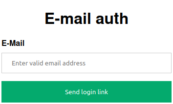

# email auth

A simple passwordless authentication middleware that uses only email as the authentication provider.

## Motivation

I wanted to restrict access to a simple HTTP service for certain users without the hassle of managing their passwords. Did not have [LDAP server](https://ldap.com/), [SSO](https://en.wikipedia.org/wiki/Single_sign-on) or [OAuth 2.0 service](https://oauth.net/2/) where their identity would be already managed. Using [Basic authentication](https://en.wikipedia.org/wiki/Basic_access_authentication) was not an option, because I would need to create a password for every single user and give it to them.

I created this simple service that prompts for a user's email, checks it against a whitelist, and then sends a login link to the provided email. Once this login link is visited, the user is granted access for a certain amount of time. Previously mentioned authentications should be used whenever available. This project is just for the sake of simplicity and minimal overhead for its users and also developer, for the applications where email communication can be trusted to grant tokens.

## Features

- Passwordless authentication.
- Manage access per email or per domain.
- Plug & Play - you only need to provide access to SMTP server.
- Easy HTML template customization.
- Optional Redis support.
- Optional API access using HTTP Basic Auth.

### Login page

### Login link received via email

### Login confirmation
Or HTTP redirect to accessed service based on HTTP Referer.

## Example with traefik

- Download `docker-compose.yaml`. Run `docker-compose up -d`.
- Navigate to `https://127.0.0.1/protected`, you will be prompted to enter your email. Only `@test.com` domain is permitted.
- After requesting login link, open `http://127.0.0.1:5000` in new tab to receive test emails.
- Visit the link you received in your email.
- You will be redirected to the originally accessed service.
